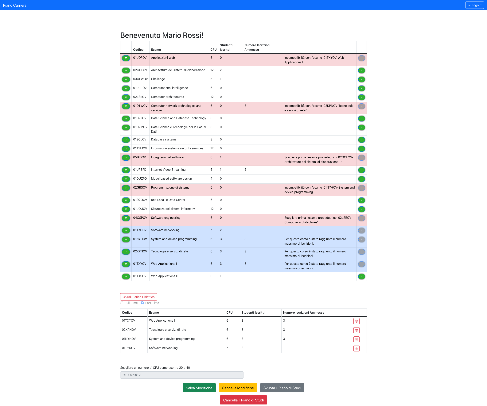
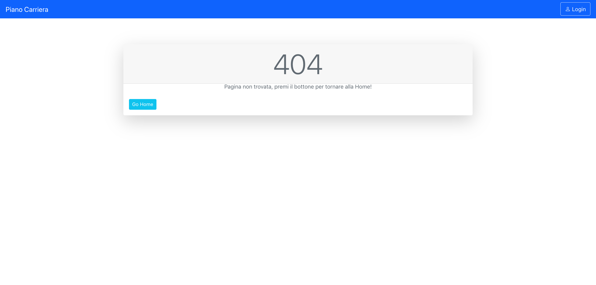

# Exam #1: "PIANO STUDI"
## Student: s294815 Pratticò Marco 

## React Client Application Routes

- Route `/`: reindirizza l'utente in `/homePage` oppure `/main` a seconda se l'utente abbia effettuato o meno il login

- Route `/main`: Home-page non logged-in. Contiene l'offerta formativa, ovvero tutti gli esami disponibili. Se l'utente ha già effettuato il logg-in allora lo reindirizzerà in `/main`.

- Route `/homePage`: Home-page logged-in. Si visualizza sia l'offerta formativa sia il piano di studi dell'utente (se già compilato)

- Route `/login`: Permette all'utente di effettuare il log-in.

- Route `/*`: Route di default (Error 404).

## API Server

- GET `/api/esami`
  - Descrizione: Richiesta di tutti gli esami disponibili.
  - Parametri richiesti: Nessuno.
  - Request body content: Nessuno.
  - Response Body content:
    - `200 OK` (success): Oggetto contenente tutti gli esami disponibili.
    - `500 Internal Server Error` (generic error)
  
- GET `/api/caricoDidattico`
  - Descrizione: Richiesta del carico didattico dell'utente contentete tutte le informazioni per la visualizzazione.
  - Parametri richiesti: Nessuno.
  - Request body content: Oggetto che rappresenta le credenziali dell'utente (id dello studente utilizzato per prendere dal server il piano di studi corretto).
  - Response Body content:
    - `200 OK` (success): Oggetto contente il piando di studi dell'utente comprensivi di tutti i campi necessari per la visualizzazione a schermo (viene fatto il join tra più tabelle e vengono prese le colonne necessarie).
    - `500 Internal Server Error` (generic error)

- PUT `/api/carico`
  - Descrizione: Richiesta di aggiunta di un esame al carico didattico dell'utente.
  - Parametri richiesti: Nessuno.
  - Request body content: Oggetto che rappresenta le credenziali e il codice dell'esame da aggiungere.
  - Response Body content:
    - `201 Created` (success): Esame aggiunto correttamente al piano di studi.
    - `422 Unprocessable Entity` (client error)
    - `500 Internal Server Error` (generic error)
  
- DELETE `/api/carico/`
  - Descrizione: Richiesta di eliminazione del piano di studi dello studente.
  - Parametri richiesti: Oggetto che rappresenta le credenziali e codice dell'esame da eliminare.
  - Request body content: Oggetto che rappresenta le credenziali.
  - Response Body content:
    - `204 OK` (success): esame eliminato correttamente.
    - `503 Service Unavailable` (Server error)
  
- POST `/api/sessions`
  - Descrizione: Effettuare il login.
  - Parametri richiesti: Nessuno.
  - Request body content: Oggetto che rappresenta le credenziali.
  - Response Body content:
    - `200 OK` (success):
    - `401 Unauthorized` (wrong code)

- DELETE `/api/sessions/current`
  - Descrizione: Effettuare il logout.
  - Parametri richiesti: Nessuno.
  - Request body content: Nessuno.
  - Response Body content:
    - `200 OK` (success)
  
- GET `/api/sessions/current`
  - Descrizione: Controllo delle informazioni dell'utente.
  - Parametri richiesti: Nessuno.
  - Request body content: Oggetto che rappresenta le credenziali.
  - Response Body content:
    - `200 OK` (success): Oggetto che rappresenta l'utente.
    - `401 Unauthorized` (wrong code)

## Database Tables

- Table `users` - Contiene id, email, password, name, salt, fullTime
  - Descrizione: contiene degli utenti.
  - id: Chiave primaria
  - fulltime:
    - 1: se l'utente ha selezionato di frequentare in modalità full-time
    - 0: se l'utente ha selezionato di frequentare in modalità part-time
    - -1: valore di default
- Table `caricoDidattico` - contiene codice, id
  - Descrizione: contiene il piano carriera degli utenti
  - codice: chiave esterna collegata a codice in esami
  - id: chiave esterna collegata a id in users
- Table `esami` - contiene codice, nome, cfu, max_studenti, incompatibile, propedeutico
  - Descrizione: contiene la lista di tutti gli esami disponibili.

## Main React Components

- `FullTable` (in `FullTable.js`): Tabella contenente tutti gli esami che viene visualizzata nella home-page non logged-in.
- `FullTableCarico` (in `CaricoDidattico.js`): Tabella contenente tutti gli esami che viene visualizzata nella home-page logged-in. Questa tabella ha in più rispetto alla precedente: il bottone di aggiunta, uno spazio per l'eventuale motivazione che spiega il perchè non può essere aggiunto. Le righe di questa tabella si colorano in maniera differente nel caso un esame sia già nel carico o nel caso non possa essere scelto. Qui viene fatta una prima validazione (prima rispetto alla validazione che viene fatta nel back-end) di ciò che lo studente può o non può inserire.
- `CaricoDidattico` (in `CaricoDidattico.js`): Tabella che contiene il piano di studi dell'user. Qui viene fatta una prima validazione (prima rispetto alla validazione che viene fatta nel back-end) di ciò che lo studente può o non può eliminare.
- `Salva Modifiche` (in `CaricoDidatticoLayout in CaricoDidattico.js`): Permette il salvataggio del piano di studi.
- `Cancella Modifiche` (in `CaricoDidatticoLayout in CaricoDidattico.js`): Permette di cancellare le modifiche che sono state fatte a partire dall'ultimo salvataggio.
- `Cancella il Piano di Studi` (in `CaricoDidatticoLayout in CaricoDidattico.js`): Permette di cancellare in maniera permanente il piano di studi e il dato relativo a full-time/part-time
- `Svuota il Piano di Studi` (in `CaricoDidatticoLayout in CaricoDidattico.js`): Permette di svuotare il piano di studi per ripartire da zero, non potendo però modificare l'opzione part-time, full-time. (ATTENZIONE: questo bottone non farà nessun salvataggio)

## Screenshot

## Users Credentials

- username: mario@polito.it, password: password -> part-time
- username: marco@polito.it, password: password -> full-time
- username: anna@polito.it,  password: password -> Piano di studi vuoto
- username: maria@polito.it, password: password -> part-time
- username: ronaldo@polito.it, password: password -> Piano di studi vuoto
- username: totti@polito.it, password: password -> Piano di studi vuoto
